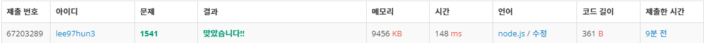

https://www.acmicpc.net/problem/1541

## [문제설명]

시간 제한 메모리 제한 제출 정답 맞힌 사람 정답 비율
2 초 128 MB 76599 41124 32275 53.078%
문제
세준이는 양수와 +, -, 그리고 괄호를 가지고 식을 만들었다. 그리고 나서 세준이는 괄호를 모두 지웠다.

그리고 나서 세준이는 괄호를 적절히 쳐서 이 식의 값을 최소로 만들려고 한다.

괄호를 적절히 쳐서 이 식의 값을 최소로 만드는 프로그램을 작성하시오.

[입력 예시]
55-50+40

[출력 예시]
-35

[풀이]
식이 0~9까지의 숫자와 +, - 를 조합한 문자열로 주어진다.
값을 최소로 만들기 위해 적절하게 괄호를 추가해야하는데
여기서 괄호는 실행의 우선순위를 의미한다.
값이 최소가 되는 방법은 + 연산자를 먼저 처리하고 - 연산자를 처리하면 한다.

1. split을 이용해서 - 연산자를 기준으로 나눈다.
2. 나뉜 배열을 + 연산자 기준으로 나눈 후 더한다


```js
require("readline")
  .createInterface(process.stdin, process.stdout)
  .on("line", (line) => {
    sol(line);
  })
  .on("close", () => {
    process.exit();
  });

function sol(line) {
  var sum = line
    .split("-") // - 연산자 기준으로 나누고 배열을 새로 생성
    .map((str) =>
      str
        .split("+") // + 연산자 기준으로 한번 더 나누고 배열을 새로 생성
        .map(Number) //생성된 배열을 숫자로 변환
        .reduce((a, b) => a + b, 0)
    ); // 값 누적

  //배열의 첫 요소 * 2 하고 모든 요소 더한 후 뺀다
  //reduce에 첫 요소가 포함되기에 *2를 함
  var result = sum[0] * 2 - sum.reduce((a, b) => a + b, 0);
  console.log(result);
}
```



```
살짝 다른 그리디 문제라서 처음에 많이 헷갈렸다.
어떻게 하면 가장 작은 결과가 나올까? 생각을 해보고 계산까지 해봤다
그래서 split과 map, reduce를 순차적으로 사용하고 console을 찍으면서 값을 추적했다.
그리디 문제라고 해서 다 정렬을 하는게 아니라는걸 처음으로 알았다. 섣부른 판단은 문제를 더 어렵게 만드는 것 같다.

```
